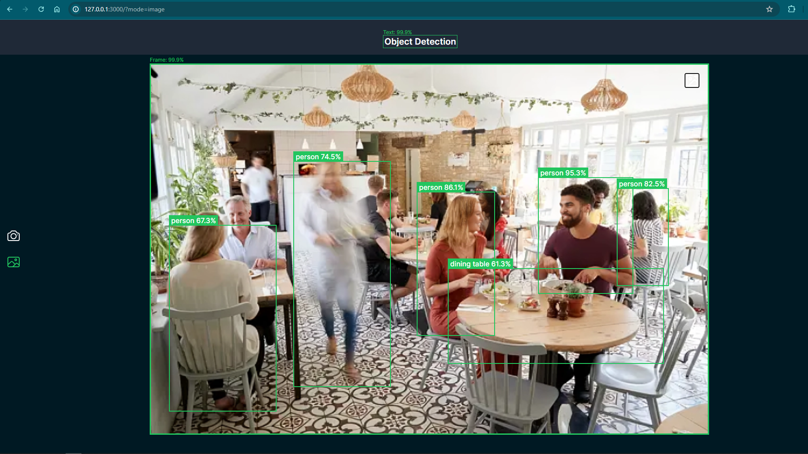

# Object Detection App

## Overview
The Object Detection App is a web application designed to detect objects in real-time using a webcam or through uploaded images. Additionally, the app allows users to set specific objects for alerts, notifying them when a set object is detected or deleted. This app leverages cutting-edge technologies to provide an efficient and user-friendly experience.



## Features
- **Real-Time Object Detection via Webcam**: Detect objects instantly using your webcam.
- **Object Detection via Image Upload**: Upload images to identify and analyze objects within them.
- **Alarm System for Specific Objects**: Set an object for alarm to receive alerts when the object is detected or deleted.

## Technology Stack
- **Frontend**: Next.js, JavaScript, TypeScript, Tailwind CSS, React
- **Machine Learning**: TensorFlow.js

## How to Run

### Clone the Repository:
```bash
git clone <repository-url>
```

### Install Dependencies:
Navigate to the project directory and run:
```bash
npm install
```

### Start the Development Server:
Run the following command to start the application locally:
```bash
npm run dev
```

### Access the Application:
Open your browser and go to:
```
http://localhost:3000
```

## Issues and Feedback
If you encounter any issues or have feedback, please open an issue on the project's GitHub repository.

## Branches
- **dev**: This is the development branch. All pull requests should be made to this branch.
- **main**: This is the production branch. Avoid making direct changes here.

## Contributing
Contributions are welcome! Follow the steps below to contribute:

1. **Clone the Repository**: Ensure you're on the `dev` branch.
2. **Create a New Branch**: 
   ```bash
   git checkout -b <branch-name>
   ```
   Example: 
   ```bash
   git checkout -b feat-object-detection
   ```
3. **Make Changes**: After making changes, stage them:
   ```bash
   git add .
   ```
4. **Commit Your Changes**: Use a descriptive commit message:
   ```bash
   git commit -m "your commit message"
   ```
5. **Sync with Upstream**: Run this command to avoid conflicts:
   ```bash
   git pull upstream dev
   ```
6. **Push Your Branch**: 
   ```bash
   git push -u origin <branch-name>
   ```
7. **Create a Pull Request**: Submit your pull request to the `dev` branch and provide a description of your changes.

## License
This project is licensed under the MIT License.
